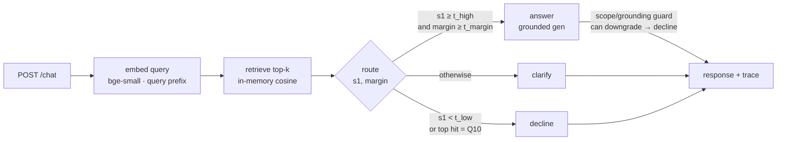

# Support RAG Agent

A small customer-support assistant over a fixed 10-entry knowledge base. It
retrieves the closest KB entry with semantic search, then decides whether to
**answer**, ask a **clarifying** question, or **decline** out-of-scope requests.
It runs on FastAPI + Ollama, locally or on a single-node Kubernetes cluster.

## Stack

- **API**: FastAPI
- **Embeddings**: `bge-small-en-v1.5` via fastembed (ONNX, CPU-only)
- **Retrieval**: in-memory cosine over the 10 entries (a vector DB is overkill at this size)
- **LLM**: Ollama running `qwen2.5:0.5b`

## Architecture



The agent and Ollama both run in-cluster. The router is plain Python — deterministic
and unit-tested — so the branch is chosen *before* any model call. Ollama only phrases
the answer and acts as a scope/grounding guard that can **downgrade** answer → decline,
never the reverse (fail-safe).

## How the agent decides

Retrieval gives a top-1 similarity (`s1`) and the gap to the runner-up
(`margin`). The route is plain Python, decided before the LLM is called:

- `s1 < t_low` or the top hit is the out-of-scope entry → **decline**
- `s1 >= t_high` and `margin >= t_margin` → **answer** (the LLM phrases the KB answer)
- otherwise → **clarify**

Thresholds live in `app/config.py` (or the ConfigMap) — `t_high=0.59`,
`t_low=0.56`, `t_margin=0.02`.

## Examples

All three branches, with the real decision trace the API returns:

**Answer** — one confident hit:

```bash
curl -s localhost:8000/chat -d '{"question":"How do I reset my password?"}'
```
```json
{
  "decision": "answer",
  "answer": "Go to the login page and click \"Forgot Password\" — a reset link arrives within 2 minutes and expires after 30 minutes.",
  "sources": [{"id": "Q1", "category": "Account", "score": 0.788}],
  "scores": {"top1": 0.788, "top2": 0.556, "margin": 0.232}
}
```

**Clarify** — in-domain but a near-tie (Q1 reset vs Q3 suspension, margin 0.005):

```bash
curl -s localhost:8000/chat -d '{"question":"I cant log in to my account."}'
```
```json
{
  "decision": "clarify",
  "answer": "Your question looks related to Account, but it could mean a couple of different things - could you tell me a bit more about exactly what you need?",
  "sources": [{"id": "Q3", "category": "Account", "score": 0.643}],
  "scores": {"top1": 0.643, "top2": 0.638, "margin": 0.005}
}
```

**Decline** — out of scope, via two independent triggers:

```bash
# top hit is the Q10 out-of-scope exemplar — high similarity (0.773), declined by scope, not threshold
curl -s localhost:8000/chat -d '{"question":"Can you help me write code for my integration project?"}'

# nothing is close (top1 0.400 < t_low) — the low-similarity floor
curl -s localhost:8000/chat -d '{"question":"Whats the weather in Essen today?"}'
```

A coding request that instead lands on the in-scope integrations entry (Q7) passes the
router but is caught by the LLM scope guard — see the [eval report](eval/results.md).

## Evaluation

Those thresholds aren't guessed — they're grid-searched on a labeled probe set
([`eval/golden.yaml`](eval/golden.yaml)) to maximise routing accuracy, breaking ties
against the costliest mistake (a confident *wrong* answer). The harness runs the real
embedder + the deterministic router, no Ollama needed:

```bash
make eval        # regenerates eval/results.md
```

Headline numbers ([full report](eval/results.md)):

- Retrieval over paraphrases: **recall@1 100%**, **MRR 1.00** — trivial at N=10, so the
  real problem here is calibration, not recall.
- Routing accuracy: **83%** across answer / clarify / decline probes. The residual
  misroutes are ambiguous-but-confident and near-scope queries — inherent limits of
  similarity-only routing on a tiny corpus, analysed honestly in the report.

## Run it locally

Needs Ollama running with the model pulled:

```bash
pip install -r requirements-dev.txt
ollama pull qwen2.5:0.5b && ollama serve &
uvicorn app.api:app --reload      # http://127.0.0.1:8000
```

Ask it something:

```bash
curl -s localhost:8000/chat -H 'Content-Type: application/json' \
     -d '{"question":"how do I reset my password?"}'
```

Or bring up the whole stack (Ollama + model + agent) with Docker:

```bash
docker compose up --build         # http://localhost:8000
```

## Run it on Kubernetes

Single-node with [kind](https://kind.sigs.k8s.io/):

```bash
make deploy      # create cluster + build/load image + apply k8s/
make pf          # port-forward to http://127.0.0.1:8080
make demo        # exercise answer / clarify / decline
make down        # tear it down
```

## API

| Method | Path | Purpose |
|---|---|---|
| POST | `/chat` | `{"question": "..."}` → decision + answer + trace |
| GET | `/healthz` | liveness |
| GET | `/readyz` | readiness (checks Ollama) |
| GET | `/metrics` | Prometheus counters |
| GET | `/docs` | Swagger UI |

## Layout

```
app/         config · models · embeddings · retriever · agent · llm_client · api · metrics · logging
ingest/      builds the retrieval index from the KB
eval/        labeled probe set + threshold-calibration harness
static/      chat UI
k8s/         namespace · config · ollama · agent · kustomization
tests/       router · retrieval · guard · API contract
```

## Tests

```bash
make test    # pytest
make lint    # ruff + mypy
```

## Design decisions

| Decision | Choice | Why | Alternative → why not |
|---|---|---|---|
| Vector store | in-memory cosine (numpy) | exact + sub-ms at N=10, zero ops | Qdrant/pgvector → ANN over 10 rows is pure overhead (see below) |
| Embeddings | bge-small-en-v1.5 via fastembed (ONNX) | 384-dim, CPU-fast, no torch/CUDA tree | sentence-transformers + torch → ~0.5–2 GB never used on CPU |
| LLM | qwen2.5:0.5b on Ollama | 32K context, CPU-friendly, mandated backend | TinyLlama → 2K context leaves no RAG headroom |
| Routing | plain-Python gate on score + top-2 margin | deterministic, testable, calibrated from data | LLM-as-router → non-deterministic, harder to calibrate |
| Manifests | raw YAML + Kustomize base | readable; hash-suffixed ConfigMap auto-rolls pods | Helm → templating indirection for one self-contained app |

## Scaling & future work

- **Vector store.** Retrieval is exact brute-force cosine over 10 vectors — at this
  size an ANN index is pure overhead. Past ~10⁴–10⁵ entries, swap `InMemoryRetriever`
  for Qdrant/pgvector with an HNSW index (tune `ef`/`M`), persistence, and metadata
  pre-filtering; the `search()` interface stays the same.
- **Out-of-scope detection** leans on the low-similarity floor, the Q10 exemplar, and a
  best-effort 0.5B scope guard. A small fine-tuned intent classifier (or a stronger
  judge model) would catch the near-scope cases the eval report flags.
- **Persistence & ops.** Chat logging, a ticket queue, and a KB-editing admin panel
  were prototyped and deliberately kept out of the core so the graded surface stays the
  agent itself; they belong behind a real datastore + auth if productionised.
- **Retrieval** could add hybrid (BM25 + dense) search and a reranker once the KB is
  large enough for lexical gaps to matter.
